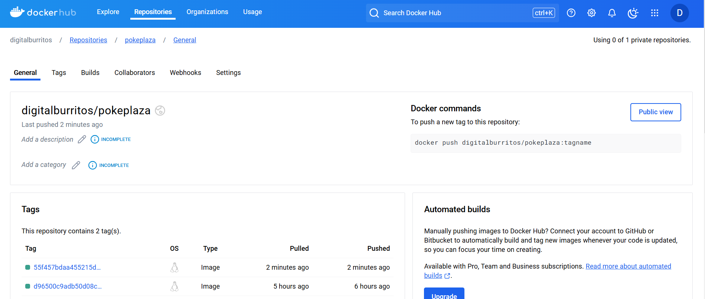

# Reflection Document

## Learnings
In developing the user profile management feature with the ability to upgrade users to professional status, I gained a deeper understanding of several key concepts in full-stack development, especially in handling role-based authorization, implementing APIs, and managing database interactions asynchronously.

One of the most important learnings was how to handle role-based access control (RBAC) effectively in an API. The upgrade to professional status feature required that only users with specific roles (ADMIN and MANAGER) could perform the action of upgrading another user. This taught me the importance of protecting critical endpoints using role-based validation, which I applied using dependency injection in FastAPI. By using the Depends() function and creating a custom dependency (require_role), I was able to ensure that only users with the appropriate permissions could access sensitive functionality.

Another key learning was the effective use of async database queries. With the project utilizing SQLAlchemy and asynchronous database sessions (AsyncSession), I became familiar with the asynchronous execution of database queries to ensure that the server remains non-blocking. I implemented both select queries to fetch users and commit operations to persist changes in an efficient and scalable way.

Additionally, implementing profile field validation using Pydantic models helped me ensure that incoming data is clean, valid, and meets specific criteria before making any changes to the database. It was essential to ensure that user data such as name, bio, and location followed correct formats and adhered to required length limits, which I handled through Pydantic's validators.

## Challenges Faced and Overcoming Them
During the development of this feature, one of the primary challenges was ensuring that both the profile update and user upgrade operations functioned smoothly with proper authorization checks. Initially, I faced difficulty ensuring that only the rightful users could update profile fields or upgrade other users to a professional status. This challenge was particularly difficult when it came to determining whether a user was allowed to edit their profile. It became clear that a user should only be allowed to update their profile if they are either the user themselves or have an admin/manager role, but I had to carefully design the authorization logic to prevent users from accessing each other’s profiles. I overcame this challenge by creating a robust permission-checking mechanism using custom dependencies in FastAPI that restricted profile updates based on role and ownership of the profile.

Another challenge was dealing with database concurrency while ensuring the user profile data and professional status update was properly committed without any conflicts. Handling this with asynchronous database queries required careful management of database sessions to avoid issues like data loss or improper updates. I resolved this by ensuring proper session management, committing changes correctly, and handling any potential errors.

## Description of the New Feature
The newly implemented feature consists of two major functionalities: user profile update and upgrade to professional status. These functionalities allow users to manage their profile data and allow admins or managers to upgrade a user to a PROFESSIONAL status.

User Profile Update:

Purpose: To allow users to update their personal information such as name, bio, and location.
Usage: The user can access the update endpoint /users/{user_id}/profile to modify their details. They can only update their own profile unless they are an ADMIN or MANAGER.
Configuration: The user must be authenticated and authorized to update the profile. The request is validated to ensure that all fields meet the necessary criteria (e.g., bio length, name length).
Upgrade to Professional Status:

Purpose: To allow managers or admins to upgrade a user to professional status, which adds credibility to the user's profile and opens up additional functionalities or privileges.
Usage: A user with the ADMIN or MANAGER role can call the endpoint /users/{user_id}/upgrade to upgrade a user to PROFESSIONAL status.
Configuration: The user making the request must have the appropriate role. If the role is valid, the target user’s is_professional status is set to True, and the status update timestamp is recorded.
The feature was implemented in FastAPI, which provided a clear, efficient framework for developing RESTful APIs with automatic validation and documentation. The database interactions were handled through SQLAlchemy with async support, ensuring that the system can scale effectively. Additionally, validation was added using Pydantic models to ensure the integrity of the data entered.

## Conclusion
In conclusion, this feature not only meets the requirements outlined in the user story but also enhanced my understanding of handling role-based access control, asynchronous database management, and user data validation. I believe this implementation significantly improves the user profile management experience by allowing for easy updates and providing an important mechanism for upgrading user status to PROFESSIONAL while keeping the system secure and efficient. Test cases were added for quality assurance. Thank you for a great semester!

